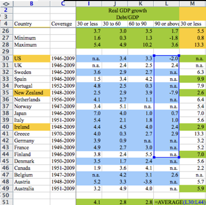
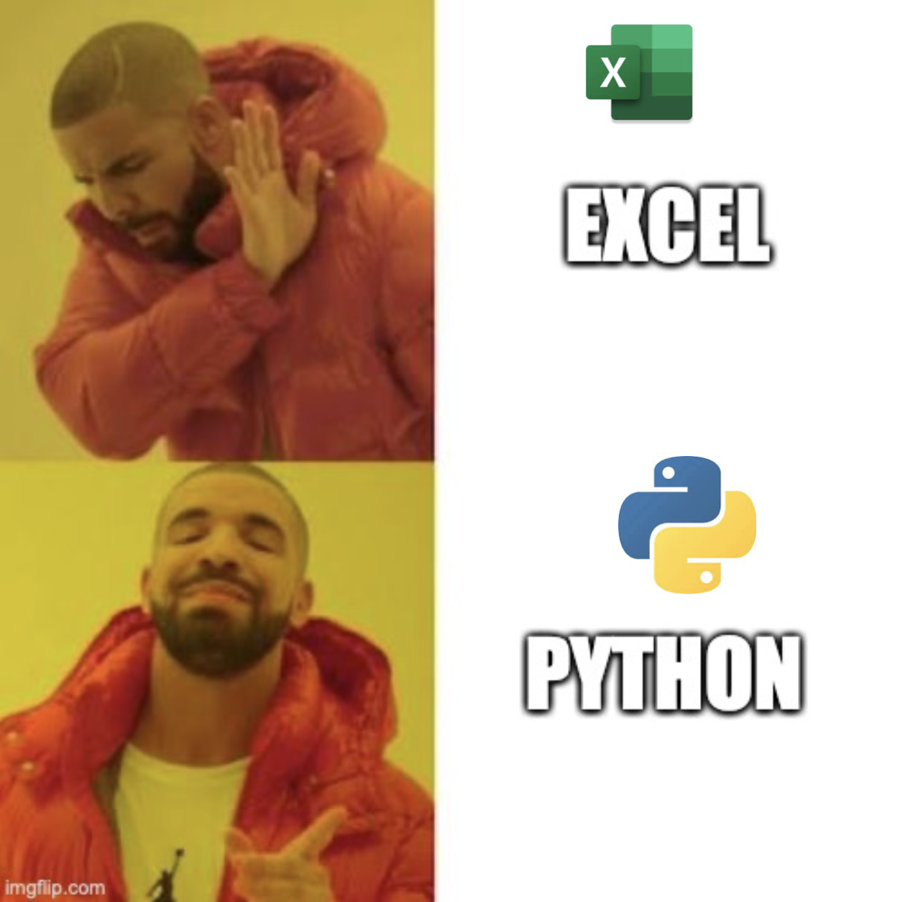

<style> /* this works for export */ @import url("/Users/skojaku-admin/Documents/projects/teaching/adv-net-sci/adv-net-sci-course/slides/m03/marp-style.css" ); /* this works in preview */ @import url( "marp-style.css" );
</style>


# <center style="margin-top:10%">Data normalization</center>

---

# <center>Data normalization</center>

<div class ="container">
<div class="col" style="margin-left:10%;flex:1">

<center>

#### Unnormalized

<div  style= "font-size:18px;">

| Person 1 | Person 2 |
| -------- | -------- |
| John     | Yu       |
| Carla    | Yu       |
| Carla    | Celine   |
| Celine   | Yu       |
| Celine   | Robert   |
| Robert   | Chang    |
| Robert   | Rob      |
| Robert   | Yu       |
| Chang    | Hana     |
| Rob      | Wilson   |
| Rob      | Diana    |
| Wilson   | Yu       |
| Simon    | Yu       |

</div>

</center>
</div>

<div class="col" style="flex:0.3;margin-right:5%">

# <center style="margin-top:250%">➡️</center>

</div>

<center class="col">

#### **Node table**

<div style= "font-size:20px;">

| node_id | Name   |
| ------- | ------ |
| 0       | John   |
| 1       | Carla  |
| 2       | Celine |
| 3       | Robert |
| 4       | Chang  |
| 5       | Hana   |
| 6       | Rob    |
| 7       | Diana  |
| 8       | Wilson |
| 9       | Simon  |
| 10      | Yu     |

</div>

</center>

<center class="col" >

#### **Edge table**

<div style= "font-size:18px;">

| src | trg |
| --- | --- |
| 0   | 10  |
| 1   | 10  |
| 1   | 2   |
| 2   | 10  |
| 2   | 3   |
| 3   | 4   |
| 3   | 5   |
| 3   | 6   |
| 4   | 7   |
| 6   | 8   |
| 6   | 9   |
| 8   | 10  |
| 9   | 10  |

</div>

</center>
</div>

---


# <center class="vindent">Data integrity</center>
<center>
...is about how well data are organized and preserved throughout its life cycle, ensuring accuracy, completeness, and consistency.
</center>

---

# <center class="vindent">Spreadsheets (Excel) considered harmful</center>

<center>

Horror stories 🙈 https://eusprig.org/research-info/horror-stories/

</center>


---

[The Reinhart-Rogoff error – or how not to Excel at economics](https://theconversation.com/the-reinhart-rogoff-error-or-how-not-to-excel-at-economics-13646)




---


<center>

[When Spreadsheets Attack! - YouTube](https://www.youtube.com/watch?v=yb2zkxHDfUE&t=1s)

<iframe width="800px" height="450px" src="https://www.youtube.com/embed/yb2zkxHDfUE?si=uArRCbz8nB4bGBaN" title="YouTube video player" frameborder="0" allow="accelerometer; autoplay; clipboard-write; encrypted-media; gyroscope; picture-in-picture; web-share" allowfullscreen></iframe>

</center>

---

[An alarming number of scientific papers contain Excel errors - The Washington Post](https://www.washingtonpost.com/news/wonk/wp/2016/08/26/an-alarming-number-of-scientific-papers-contain-excel-errors/?postshare=4161472211255740)


---

#### <center style="font-size:70px;margin-top:15%">Data analysis 💔 Excel </center>

# <center style="font-size:100px">😭😭😭 </center>

---

<div class="container">

<div class="col" style="flex:1">

<center class="vindent" style="margin-top:50%"> Zen of Python</center>

### <center> *"Explicit is better than implicit"* </center>


</div>
<div class="col" style="flex:0.8">

<div style="font-size:30px;margin-top:50%">


```python
import this
```

```
Beautiful is better than ugly.
Explicit is better than implicit.
Simple is better than complex.
Complex is better than complicated.
Flat is better than nested.
Sparse is better than dense.
Readability counts.
Special cases aren't special enough to break the rules.
Although practicality beats purity.
Errors should never pass silently.
Unless explicitly silenced.
In the face of ambiguity, refuse the temptation to guess.
There should be one-- and preferably only one --obvious way to do it.
Although that way may not be obvious at first unless you're Dutch.
Now is better than never.
Although never is often better than *right* now.
If the implementation is hard to explain, it's a bad idea.
If the implementation is easy to explain, it may be a good idea.
Namespaces are one honking great idea -- let's do more of those!
```

</div>
</div>
</div>

---
#### What is the potential problem of not being explicit?

Example:
```python
import pandas as pd
data_table = pd.read_csv(filename)
```

Data that may break this code?

- Zip code
- ...anything else?

---

#### What is the potential problem of not being explicit?

Example:
```python
import pandas as pd
data_table = pd.read_csv(filename)
```


---

Always specify the data types:

```
import pandas as pd

contact_data_table = pd.read_csv(
    filename,
    dtype={
        "user_a": str,
        "user_b": str,
        "rssi": int,
        "#timestamp": int,
    },
)

```

---

# <center> Data <div class="red">Provenance</div> </center>

- Documented trail of data from its generation to the current.
- Where the data was taken from, how it was processed and transformed into the current data.

---




---